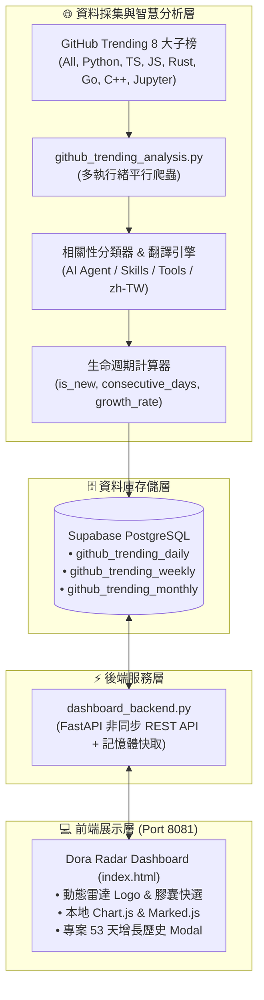

# 📡 Dora Radar (開源趨勢雷達 · AI 智能體自我進化觀測站)

<div align="center">


**全自主 AI 開源趨勢雷達 — 多語言平行採集矩陣 · 智慧生命週期追蹤 · 繁中雙語翻譯 · 視覺化科技儀表板**

</div>

---

## 🌟 核心特色 (Core Features)

### 1. 🌐 多技術榜平行採集矩陣 (Multi-Channel Scraping Matrix)
- 突破傳統單一榜單限制，平行採集 **8 大技術頻道**：
  - `All`（全站總榜）、`Python`、`TypeScript`、`JavaScript`、`Rust`、`Go`、`C++`、`Jupyter Notebook`。
- 多執行緒並行抓取，2 秒內完成全網 130+ 不重複專案採集與跨榜特徵合併。

### 2. 🏷️ 智慧生命週期特徵分析 (Smart Lifecycle Intelligence)
- **✨ `is_new`（今日首發新面孔）**：自動比對歷史 60 天數據，精準標記首次上榜專案，告別常客審美疲勞。
- **🔥 `consecutive_days`（連續霸榜天數）**：追蹤現象級專案的持續熱度天數。
- **🚀 `growth_rate`（星數爆發加速度）**：計算 $\frac{\text{今日新增}}{\text{總 Star}}$ 比率，搶先發掘剛起步的小型潛力黑馬。

### 3. 🔤 全自動繁體中文化引擎 (Auto zh-TW Translation)
- 內建多通道自動翻譯機制（Google Web Client + MyMemory Fallback）。
- 每日新專案入庫時自動生成高品質繁體中文說明，支援中英雙語對照排版與中英雙向即時搜尋。

### 4. 🎨 Dora Radar 視覺化科技儀表板 (Futuristic Web Dashboard)
- **動態科技雷達 SVG Logo**：內建 60fps 平滑旋轉掃描光束與呼吸觀測節點。
- **即時膠囊快選 (Quick Filter Pills)**：`[ 🌐 全部專案 ]`、`[ ✨ 今日首發新面孔 ]`、`[ 🚀 爆發潛力黑馬 ]`、`[ 🔥 連續霸榜常客 ]`。
- **圖表與歷史軌跡**：本地整合 Chart.js，支援程式語言佔比圓餅圖、AI 相關性長條圖，以及單一專案 50+ 天歷史 Star 增長曲線 Modal。
- **雜誌級日報閱讀器**：本地整合 Marked.js，支援圖文排版與 Markdown 原始碼一鍵切換與複製。

---

## 🏗️ 系統架構 (Architecture)



---

## 📂 檔案結構 (Directory Structure)

```
.
├── dashboard_backend.py         # FastAPI 非同步後端 API 與靜態檔案託管
├── github_trending_analysis.py  # 多頻道爬蟲、AI 相關性分類、生命週期分析與日報生成
├── latest_insight.json          # Dora AI 最新觀點結構化數據快取
├── run_trending.sh              # 定時排程執行腳本
├── frontend/
│   ├── index.html               # Dora Radar 儀表板單頁應用 (SPA)
│   ├── chart.min.js             # 本地 Chart.js 4.4.1 核心庫
│   └── marked.min.js            # 本地 Marked.js Markdown 解析器
├── DESIGN.md                    # 系統架構與設計文檔
├── PRODUCT.md                   # 產品規格與功能定義
├── .gitignore                   # Git 忽略清單
└── README.md                    # 專案說明文件
```

---

## 🚀 快速開始 (Quick Start)

### 1. 安裝相依套件

```bash
pip install fastapi uvicorn httpx pydantic
```

### 2. 環境變數設定

建立 `.env` 或確認 Supabase 連線資訊：

```env
SUPABASE_URL=http://your-supabase-host:8000
SUPABASE_ANON_KEY=your_anon_key
SUPABASE_SERVICE_ROLE_KEY=your_service_role_key
```

### 3. 資料庫 Schema 初始化 (PostgreSQL)

```sql
CREATE TABLE IF NOT EXISTS github_trending_daily (
    id BIGSERIAL PRIMARY KEY,
    date DATE NOT NULL,
    repo_name TEXT NOT NULL,
    repo_url TEXT NOT NULL,
    description TEXT,
    description_zh TEXT,
    total_stars BIGINT DEFAULT 0,
    today_stars INT DEFAULT 0,
    forks INT DEFAULT 0,
    language TEXT,
    language_color TEXT,
    relevance_level TEXT,
    relevance_tags TEXT[],
    is_new BOOLEAN DEFAULT FALSE,
    consecutive_days INT DEFAULT 1,
    growth_rate NUMERIC(6,2) DEFAULT 0,
    channels TEXT[] DEFAULT '{}',
    created_at TIMESTAMPTZ DEFAULT NOW(),
    UNIQUE(date, repo_name)
);

CREATE TABLE IF NOT EXISTS github_trending_weekly (
    id BIGSERIAL PRIMARY KEY,
    week_start DATE NOT NULL,
    week_end DATE NOT NULL,
    repo_name TEXT NOT NULL,
    repo_url TEXT NOT NULL,
    description TEXT,
    description_zh TEXT,
    total_stars BIGINT DEFAULT 0,
    peak_today_stars INT DEFAULT 0,
    avg_daily_stars NUMERIC(10,2) DEFAULT 0,
    language TEXT,
    language_color TEXT,
    forks INT DEFAULT 0,
    relevance_level TEXT,
    relevance_tags TEXT[],
    is_new BOOLEAN DEFAULT FALSE,
    channels TEXT[] DEFAULT '{}',
    created_at TIMESTAMPTZ DEFAULT NOW(),
    UNIQUE(week_start, repo_name)
);

CREATE TABLE IF NOT EXISTS github_trending_monthly (
    id BIGSERIAL PRIMARY KEY,
    month_start DATE NOT NULL,
    month_end DATE NOT NULL,
    repo_name TEXT NOT NULL,
    repo_url TEXT NOT NULL,
    description TEXT,
    description_zh TEXT,
    total_stars BIGINT DEFAULT 0,
    peak_today_stars INT DEFAULT 0,
    total_appearances INT DEFAULT 0,
    avg_daily_stars NUMERIC(10,2) DEFAULT 0,
    language TEXT,
    language_color TEXT,
    forks INT DEFAULT 0,
    relevance_level TEXT,
    relevance_tags TEXT[],
    trend_direction TEXT,
    is_new BOOLEAN DEFAULT FALSE,
    channels TEXT[] DEFAULT '{}',
    created_at TIMESTAMPTZ DEFAULT NOW(),
    UNIQUE(month_start, repo_name)
);
```

### 4. 執行採集與分析

```bash
python3 github_trending_analysis.py
```

### 5. 啟動後端服務

```bash
uvicorn dashboard_backend:app --host 0.0.0.0 --port 8081 --workers 2
```

開啟瀏覽器造訪 `http://localhost:8081` 即可進入 Dora Radar！

---

## 📡 REST API 端點 (API Endpoints)

| 方法 | 路徑 | 說明 |
|---|---|---|
| `GET` | `/` | 託管前端首頁 (`index.html`) |
| `GET` | `/api/daily` | 取得每日熱門專案列表 (支援 `date`, `limit`, `sort`) |
| `GET` | `/api/weekly` | 取得每週統整去重專案 |
| `GET` | `/api/monthly` | 取得每月趨勢專案 |
| `GET` | `/api/stats` | 取得全域統計數據與相關性分佈 |
| `GET` | `/api/languages` | 取得開源程式語言排行與統計 |
| `GET` | `/api/trends/rising-stars` | 取得連續霸榜常客與高成長專案 |
| `GET` | `/api/trends/daily-top` | 取得過去 N 天單日最高增長專案 |
| `GET` | `/api/repo/{owner}/{repo}/history` | 取得特定專案的歷史星數增長曲線 |
| `GET` | `/api/ai/latest-insight` | 取得 Dora 最新 AI 觀點與完整日報 |
| `POST`| `/api/scrape/trigger` | 即時手動觸發爬蟲全流程採集 |

---

## ⚙️ Systemd 守護進程設定

建立 `~/.config/systemd/user/dora-dashboard.service`：

```ini
[Unit]
Description=Dora GitHub Trending Radar Service
After=network.target

[Service]
Type=simple
WorkingDirectory=/home/pipadmin/.hermes/scripts
ExecStart=/usr/bin/python3 -m uvicorn dashboard_backend:app --host 0.0.0.0 --port 8081
Restart=always
RestartSec=5

[Install]
WantedBy=default.target
```

啟動與常駐：

```bash
systemctl --user daemon-reload
systemctl --user enable dora-dashboard.service
systemctl --user start dora-dashboard.service
```

---

## 📄 授權條款 (License)

本專案採用 [MIT License](LICENSE) 授權。
