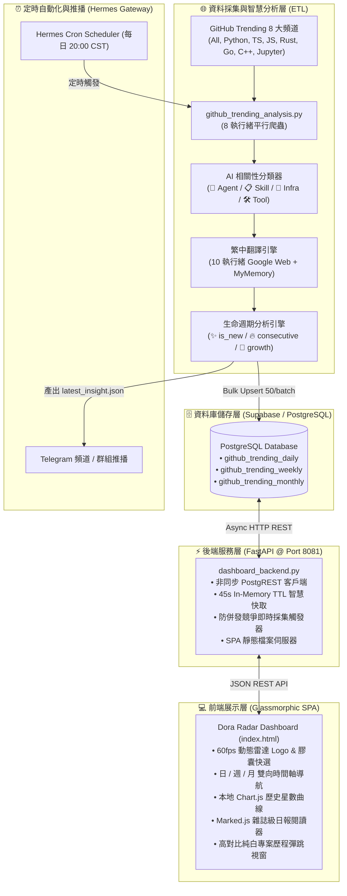

# 📡 Dora Radar (開源趨勢雷達 · AI Agent 智慧進化觀測站)

<div align="center">


**全自主 AI 開源趨勢雷達 — 多語言平行採集矩陣 · 智慧生命週期追蹤 · 繁體中文智慧翻譯 · 跨週期聚合導航 · Glassmorphic 現代科技儀表板**

[功能特色](#-核心亮點-key-features) • [系統架構](#-系統架構-architecture) • [資料庫設計](#-資料庫架構-database-schema) • [API 手冊](#-rest-api-端點手冊-api-reference) • [快速開始](#-快速安裝與部署-quick-start) • [生命週期演算法](#-生命週期與評分演算法-lifecycle-intelligence)

</div>

---

## 📖 專案簡介 (Overview)

**Dora Radar** 不僅僅是 GitHub Trending 的靜態鏡像，而是一套專為 **AI Agent 架構師、開源探勘者與技術決策者** 量身打造的深度開源情報觀測系統。

系統每日定時對 GitHub 8 大技術榜單發起多執行緒平行爬取，結合自研 NLP 關鍵詞相關性引擎自動識別 AI Agent、提示詞工程、模型微調及開源工具鏈。透過內建的多通道翻譯機制，將第一手英文專案描述轉化為高精度的繁體中文；同時比對長期歷史資料庫，即時計算專案生命週期狀態（**今日首發新面孔**、**連續霸榜常客**、**星數爆發黑馬**），並自動聚合日、週、月跨維度趨勢。所有資料皆由高效能 FastAPI 後端驅動，並於現代美學的 Glassmorphic 淺色儀表板呈現，輔以 Telegram 定時推播，實現開源情報的全自主端到端監控。

---

## 🌟 核心亮點 (Key Features)

### 1. 🌐 多技術榜平行採集矩陣 (8-Channel Scraping Matrix)
- **覆蓋 8 大技術子榜**：同時監控 `All`（全站總榜）、`Python`、`TypeScript`、`JavaScript`、`Rust`、`Go`、`C++`、`Jupyter Notebook`。
- **多執行緒平行採集**：透過 `ThreadPoolExecutor` 平行抓取，2 秒內解析 130+ 不重複專案。
- **跨頻道歸併與多重標籤**：自動識別跨榜專案（例如同時在 `All` 與 `Rust` 霸榜），保留更完整的技術中繼資料 (Metadata)。

### 2. 🏷️ 智慧生命週期分析 (Smart Lifecycle Intelligence)
- ✨ **今日首發新面孔 (`is_new`)**：比對歷史 60+ 天資料庫，自動篩選出首次進入熱門榜的專案，避免長期被巨型專案佔據版面帶來的資訊疲勞。
- 🔥 **連續霸榜天數 (`consecutive_days`)**：動態追蹤專案連續維持熱門狀態的累積天數，識別長期具有高技術熱度的現象級專案。
- 🚀 **星數爆發加速度 (`growth_rate`)**：計算公式為 $\frac{\text{今日新增 Star}}{\text{專案總 Star}} \times 100\%$，第一時間捕捉剛開源即引爆社群關注的超潛力黑馬。

### 3. 🔤 繁體中文智慧翻譯與在地化 (Auto zh-TW Localization)
- **多通道容錯翻譯引擎**：優先透過 Google Web Client 翻譯介面獲取流暢繁體中文，並在異常時自動無縫降級至 MyMemory API。
- **純淨在地化視覺體驗**：前端卡片與專案歷程彈跳視窗經過專屬排版最佳化，專注純繁體中文呈現，去除冗餘的次要英文重疊，提升資訊吸收效率。
- **中英雙語即時搜尋**：支援透過專案名稱、英文原描述或繁中翻譯摘要進行全文模糊比對。

### 4. 📅 全週期維度追蹤與時間軸導航 (Daily / Weekly / Monthly Timeline)
- **📡 今日熱門雷達 (Daily)**：當日最活躍專案列表，支援 `[全部專案]`、`[今日首發]`、`[爆發黑馬]`、`[連續霸榜]` 膠囊快選。
- **📅 週度彙總統計 (Weekly)**：回填歷史 14+ 週（2,400+ 筆去重記錄），呈現當週最高單日星數 (`peak_today_stars`) 與日均新增星數 (`avg_daily_stars`)。
- **📆 月度趨勢走向 (Monthly)**：回填歷史 4+ 個月（1,900+ 筆去重記錄），呈現全月累積上榜天數 (`total_appearances`) 與月度趨勢方向 (`trend_direction`)。
- **雙向時間軸導航器**：日、週、月頁籤皆提供「前一週期」、「後一週期」、「最新週期」切換步進按鈕，以及支援隨選任意歷史週期的專屬日曆與下拉選單。

### 5. ⚡ 極致 ETL 採集效能 (High-Performance Pipeline)
- **批次 Upsert (Bulk Insert)**：從原本逐筆寫入升級為 50 筆批次提交，大幅減少 HTTP RTT 往返延遲。
- **平行化翻譯管線**：以 10 執行緒並行發起繁中翻譯，採集全流程耗時由 **40 秒大幅壓縮至 4.5 秒**（效能躍升 8.8 倍）。
- **無損 PostgREST 分頁**：徹底解決 PostgREST 預設 1,000 筆查詢截斷問題，保證多月歷史資料統計精確無遺漏。

### 6. 🎨 現代毛玻璃科技儀表板 (Glassmorphic Light Design System)
- **現代明亮毛玻璃美學**：採用細膩的半透明玻璃質感 (`backdrop-filter`)、柔和漫射陰影、全域圓角邊框與環境光漸變背景。
- **頂級排版與圖示**：全站整合 Google Material Symbols Outlined 圖示，搭配現代幾何字體 Plus Jakarta Sans 與等寬科技字體 JetBrains Mono。
- **高對比彈跳視窗專案歷程 (Solid White Modal)**：彈跳視窗採用 100% 不透明純白背景，杜絕背景透明干擾，並支援背景滾動鎖定與 ESC 鍵一鍵關閉。
- **動態科技雷達 SVG Logo**：自研 60fps 平滑旋轉掃描光束與呼吸微動畫觀測節點。
- **本地圖表與日報渲染**：整合 Chart.js（語言圓餅圖、AI 相關性長條圖、50+ 天歷史增長折線圖）與 Marked.js（雜誌級日報閱讀器，支援 Markdown 原始碼一鍵複製）。

### 7. 🤖 Dora 智囊 AI 觀點與歷史日報歸檔 (AI Daily Insights)
- **每日 TOP 3 精選專案**：結合專案領域、發展潛力與 AI Agent 進化價值，產出深入的 Dora 智囊短評。
- **Telegram 日報格式化**：自動產出適用於通訊軟體與社群推播的精美 Markdown 日報。
- **歷次報告隨選回顧**：前端下拉選單收錄近 30+ 期歷史日報歸檔，方便回溯過往開源脈動。

### 8. 🛡️ 透明排程監控與即時回饋 (Transparent Cron & Live Scrape)
- **透明排程狀態列**：頂部導航即時呈現 Hermes 閘道排程狀態、上次巡檢成果、推播頻道與下次巡檢倒數。
- **手動即時觸發與輪詢**：提供「即時採集」按鈕，內建後端防併發競爭鎖 (`is_scraping`)、旋轉載入動畫與動態 Toast 耗時回饋。

---

## 🏗️ 系統架構 (Architecture)



---

## 📂 專案目錄結構 (Directory Structure)

```
dora-radar/
├── dashboard_backend.py         # FastAPI 非同步後端 API 服務與靜態資源託管
├── github_trending_analysis.py  # 8 頻道平行爬蟲、相關性分類、繁中翻譯、生命週期計算與日報生成
├── latest_insight.json          # 最新一期 Dora 智囊觀點結構化資料
├── run_trending.sh              # 自動化定時排程執行腳本
├── insights/                    # 歷史每日 AI 智囊觀點與日報 JSON 歸檔
│   ├── insight_2026-09-22.json
│   ├── insight_2026-09-23.json
│   └── insight_2026-09-24.json
├── frontend/                    # 前端單頁應用 (SPA)
│   ├── index.html               # Dora Radar 現代毛玻璃儀表板
│   ├── chart.min.js             # 本地 Chart.js 核心庫 (離線優先，支援 CDN Fallback)
│   └── marked.min.js            # 本地 Marked.js Markdown 解析器
├── DESIGN.md                    # 系統架構與設計語彙規範文件
├── PRODUCT.md                   # 產品規格需求定義與價值矩陣
├── STATE.md                     # 系統運行健康度狀態與維護日誌
├── .gitignore                   # Git 版本控制忽略清單
└── README.md                    # 專案完整說明文件
```

---

## 🗄️ 資料庫架構 (Database Schema)

本專案使用 PostgreSQL / Supabase 作為資料持久化儲存，包含三張核心資料表：

```sql
-- 1. 每日熱門趨勢資料表
CREATE TABLE IF NOT EXISTS github_trending_daily (
    id BIGSERIAL PRIMARY KEY,
    date DATE NOT NULL,
    repo_name TEXT NOT NULL,
    repo_url TEXT NOT NULL,
    description TEXT,
    description_zh TEXT,
    total_stars BIGINT DEFAULT 0,
    today_stars INT DEFAULT 0,
    forks INT DEFAULT 0,
    language TEXT,
    language_color TEXT,
    relevance_level TEXT,            -- critical, high, medium, low
    relevance_tags TEXT[],           -- 命中的關鍵詞標籤陣列
    is_new BOOLEAN DEFAULT FALSE,    -- 是否為歷史首次上榜
    consecutive_days INT DEFAULT 1,  -- 連續霸榜天數
    growth_rate NUMERIC(6,2) DEFAULT 0, -- 今日增長百分比
    channels TEXT[] DEFAULT '{}',    -- 命中的技術頻道清單
    created_at TIMESTAMPTZ DEFAULT NOW(),
    UNIQUE(date, repo_name)
);

CREATE INDEX IF NOT EXISTS idx_trending_daily_date ON github_trending_daily(date DESC);
CREATE INDEX IF NOT EXISTS idx_trending_daily_repo ON github_trending_daily(repo_name);
CREATE INDEX IF NOT EXISTS idx_trending_daily_stars ON github_trending_daily(today_stars DESC);

-- 2. 週度彙總統計資料表
CREATE TABLE IF NOT EXISTS github_trending_weekly (
    id BIGSERIAL PRIMARY KEY,
    week_start DATE NOT NULL,
    week_end DATE NOT NULL,
    repo_name TEXT NOT NULL,
    repo_url TEXT NOT NULL,
    description TEXT,
    description_zh TEXT,
    total_stars BIGINT DEFAULT 0,
    peak_today_stars INT DEFAULT 0,  -- 該週單日最高增長星數
    avg_daily_stars NUMERIC(10,2) DEFAULT 0, -- 該週平均每日增長星數
    language TEXT,
    language_color TEXT,
    forks INT DEFAULT 0,
    relevance_level TEXT,
    relevance_tags TEXT[],
    is_new BOOLEAN DEFAULT FALSE,
    channels TEXT[] DEFAULT '{}',
    created_at TIMESTAMPTZ DEFAULT NOW(),
    UNIQUE(week_start, repo_name)
);

CREATE INDEX IF NOT EXISTS idx_trending_weekly_start ON github_trending_weekly(week_start DESC);

-- 3. 月度走向趨勢統計資料表
CREATE TABLE IF NOT EXISTS github_trending_monthly (
    id BIGSERIAL PRIMARY KEY,
    month_start DATE NOT NULL,
    month_end DATE NOT NULL,
    repo_name TEXT NOT NULL,
    repo_url TEXT NOT NULL,
    description TEXT,
    description_zh TEXT,
    total_stars BIGINT DEFAULT 0,
    peak_today_stars INT DEFAULT 0,  -- 該月單日最高增長星數
    total_appearances INT DEFAULT 0, -- 該月累積上榜天數
    avg_daily_stars NUMERIC(10,2) DEFAULT 0, -- 該月日均新增星數
    language TEXT,
    language_color TEXT,
    forks INT DEFAULT 0,
    relevance_level TEXT,
    relevance_tags TEXT[],
    trend_direction TEXT,            -- exploding, rising, stable
    is_new BOOLEAN DEFAULT FALSE,
    channels TEXT[] DEFAULT '{}',
    created_at TIMESTAMPTZ DEFAULT NOW(),
    UNIQUE(month_start, repo_name)
);

CREATE INDEX IF NOT EXISTS idx_trending_monthly_start ON github_trending_monthly(month_start DESC);
```

---

## 📡 REST API 端點手冊 (API Reference)

FastAPI 後端於預設連接埠 `8081` 運行，提供高吞吐的非同步 API：

| 方法 | 端點路徑 | 查詢參數 | 說明 |
|---|---|---|---|
| `GET` | `/` | 無 | 託管 Dora Radar 前端單頁應用 (`index.html`) |
| `GET` | `/health` | 無 | 系統健康狀態檢查、版本號與目前快取數量 |
| `GET` | `/api/dates` | `limit` (預設 60) | 取得所有歷史有記錄的日度日期清單（由新至舊） |
| `GET` | `/api/daily` | `date`, `limit`, `sort`, `search`, `channel` | 取得指定日期的熱門專案列表，支援中英模糊搜尋 |
| `GET` | `/api/daily/latest` | 同上 | 取得資料庫中最新一天的熱門專案列表 |
| `GET` | `/api/daily/stats` | `date` | 取得指定日期的統計指標（專案數、總星數、語言分佈、AI 相關性） |
| `GET` | `/api/weeks` | 無 | 取得所有可用的週度週期清單（起始日與結束日） |
| `GET` | `/api/weekly` | `week_start`, `limit`, `sort`, `search` | 取得特定週度的去重彙總專案排行 |
| `GET` | `/api/months` | 無 | 取得所有可用的月度週期清單 |
| `GET` | `/api/monthly` | `month_start`, `limit`, `sort`, `search` | 取得特定月份的長期走向去重專案排行 |
| `GET` | `/api/languages` | `date` | 取得當日程式語言佔比排行統計 |
| `GET` | `/api/trends/rising-stars` | `days` (預設 7) | 取得連續霸榜超過 3 天以上的穩定熱門專案清單 |
| `GET` | `/api/trends/daily-top` | `days` (預設 7) | 取得近 N 天內單日新增星數最高的超級新星 |
| `GET` | `/api/repo/{owner}/{repo}/history` | `limit` (預設 60) | 取得特定專案的歷史星數增長曲線與每日變化資料 |
| `GET` | `/api/ai/latest-insight` | 無 | 取得 Dora 最新生成的 AI 觀點、TOP 3 專案與 Telegram 格式日報 |
| `GET` | `/api/ai/insights/history` | 無 | 取得所有已歸檔的歷史 Dora 智囊日報列表 |
| `GET` | `/api/ai/insights/report/{filename}`| 無 | 讀取特定日期的歷史日報詳細內容 |
| `GET` | `/api/cron/status` | 無 | 取得定時排程狀態、執行歷史、上次與下次巡檢時間 |
| `GET` | `/api/scrape/status` | 無 | 輪詢目前後端即時採集任務的執行狀態與耗時 |
| `POST`| `/api/scrape/trigger` | 無 | 手動觸發即時全網爬蟲管線（具備防併發競爭鎖） |

---

## 💡 生命週期與評分演算法 (Lifecycle Intelligence)

### 1. 相關性等級劃分 (Relevance Classification)
系統透過特徵字典對專案名稱與說明文字進行多維度加權評分：
- **🤖 Critical (極度相關)**：包含 `agent`、`autonomous`、`orchestrat`、`multi-agent`、`mcp`、`claude code`、`cursor`、`copilot`、`devin` 等關鍵字，專注 AI Agent 核心架構。
- **📋 High (高度相關)**：包含 `skill`、`planning`、`self-improvement`、`prompt`、`reflection`、`memory`、`reasoning` 或同時命中 3 個以上特徵。
- **🔧 Medium (中度相關)**：包含 `llm`、`vllm`、`fine-tune`、`transformer`、`embedding`、`rag` 等模型與推論基礎建設。
- **🛠 Low (一般通用)**：開發者常規工具、終端機 CLI、圖形編輯器、資料庫等一般開源專案。

### 2. 星數爆發加速度公式
$$\text{Growth Rate (\%)} = \min\left(100.0, \; \frac{\text{今日新增 Star}}{\text{專案總 Star}} \times 100\%\right)$$
- 當比率高於 **15%** 時，自動被系統列為「🚀 爆發黑馬」關注對象。

### 3. 連續霸榜天數 (`consecutive_days`)
- 採集時自動比對前一日資料庫記錄：若專案前一日亦在熱門榜，則連續天數累加 1；若昨日未上榜，則連續天數重置為 1。

---

## 🚀 快速安裝與部署 (Quick Start)

### 1. 環境需求
- Python 3.10 以上
- PostgreSQL 14+ 或 Supabase 本地 / 雲端實例
- Linux / macOS / Windows WSL2

### 2. 複製專案與安裝相依套件

```bash
git clone https://github.com/Mi44Or30/dora-radar.git
cd dora-radar

# 建立並啟動 Python 虛擬環境
python3 -m venv venv
source venv/bin/activate

# 安裝核心套件
pip install fastapi uvicorn httpx pydantic
```

### 3. 設定環境變數

建立 `.env` 檔案並填入您的 Supabase / PostgreSQL PostgREST 連線參數：

```env
SUPABASE_URL=http://your-supabase-host:8000
SUPABASE_ANON_KEY=your_supabase_anon_key
SUPABASE_SERVICE_ROLE_KEY=your_supabase_service_role_key
```

### 4. 初始化資料庫 Schema
使用 PostgreSQL 客戶端（如 `psql` 或 Supabase SQL Editor）執行本專案提供的 [資料庫架構 Schema](#-資料庫架構-database-schema)。

### 5. 執行首次資料採集與分析

```bash
python3 github_trending_analysis.py
```
> 執行後將平行採集 8 大頻道、進行繁中翻譯、計算生命週期指標、批量寫入資料庫，並於根目錄產出 `latest_insight.json`。

### 6. 啟動後端服務

```bash
uvicorn dashboard_backend:app --host 0.0.0.0 --port 8081 --workers 2
```

開啟瀏覽器前往 `http://localhost:8081` 即可體驗 Dora Radar 儀表板！

---

## ⚙️ 系統常駐與定時排程 (Daemon & Automation)

### 1. 使用 Systemd 常駐後端服務

建立使用者層級服務設定檔 `~/.config/systemd/user/dora-dashboard.service`：

```ini
[Unit]
Description=Dora GitHub Trending Radar Service
After=network.target

[Service]
Type=simple
WorkingDirectory=/path/to/dora-radar
ExecStart=/usr/bin/python3 -m uvicorn dashboard_backend:app --host 0.0.0.0 --port 8081
Restart=always
RestartSec=5

[Install]
WantedBy=default.target
```

載入並啟動服務：

```bash
systemctl --user daemon-reload
systemctl --user enable dora-dashboard.service
systemctl --user start dora-dashboard.service
```

### 2. 設定每日定時採集 (Cron Job)

使用 Linux `crontab -e` 設定每日晚間 20:00 自動執行：

```bash
0 20 * * * cd /path/to/dora-radar && /path/to/venv/bin/python3 github_trending_analysis.py >> /tmp/dora_trending.log 2>&1
```

*(若使用 Hermes Agent 生態，亦可透過 Hermes Scheduler 自動調度並整合 Telegram 頻道推播)*。

---

## 🛠️ 技術堆疊 (Tech Stack)

| 領域 | 核心技術 | 角色說明 |
|---|---|---|
| **後端核心** | [FastAPI](https://fastapi.tiangolo.com/) | 高並發非同步 RESTful API、靜態資源路由 |
| **ASGI 伺服器** | [Uvicorn](https://www.uvicorn.org/) | 輕量高吞吐 ASGI 伺服器 |
| **資料持久化** | [Supabase](https://supabase.com/) / [PostgreSQL](https://www.postgresql.org/) | 結構化趨勢資料儲存、PostgREST 關聯查詢 |
| **前端架構** | 原生 HTML5 / CSS3 / ES6+ SPA | 無需繁瑣打包構建步驟，開箱即用 |
| **視覺美學** | Glassmorphism + Material Symbols | 明亮淺色毛玻璃質感、高對比彈跳視窗、現代幾何字體 |
| **資料視覺化** | [Chart.js 4.4+](https://www.chartjs.org/) | 語言圓餅圖、AI 長條圖、專案歷史增長曲線 |
| **內容排版** | [Marked.js](https://marked.js.org/) | 雜誌級日報 Markdown 即時解析與渲染 |
| **定時排程** | Hermes Scheduler / Systemd | 全自動無人值守定時巡檢與 Telegram 推播 |

---

## 🤝 參與貢獻 (Contributing)

歡迎提交 Issue 與 Pull Request 一同完善 Dora Radar！
1. Fork 本專案儲存庫 (`https://github.com/Mi44Or30/dora-radar.git`)
2. 建立您的特性分支 (`git checkout -b feat/amazing-feature`)
3. 提交您的變更 (`git commit -m 'feat: Add amazing feature'`)
4. 推送至遠端分支 (`git push origin feat/amazing-feature`)
5. 發起 Pull Request

---

## 📄 授權條款 (License)

本專案採用 [MIT License](LICENSE) 授權開源，歡迎社群自由使用、修改與二次開發。
